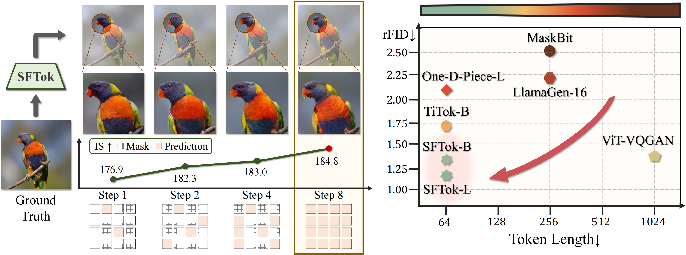
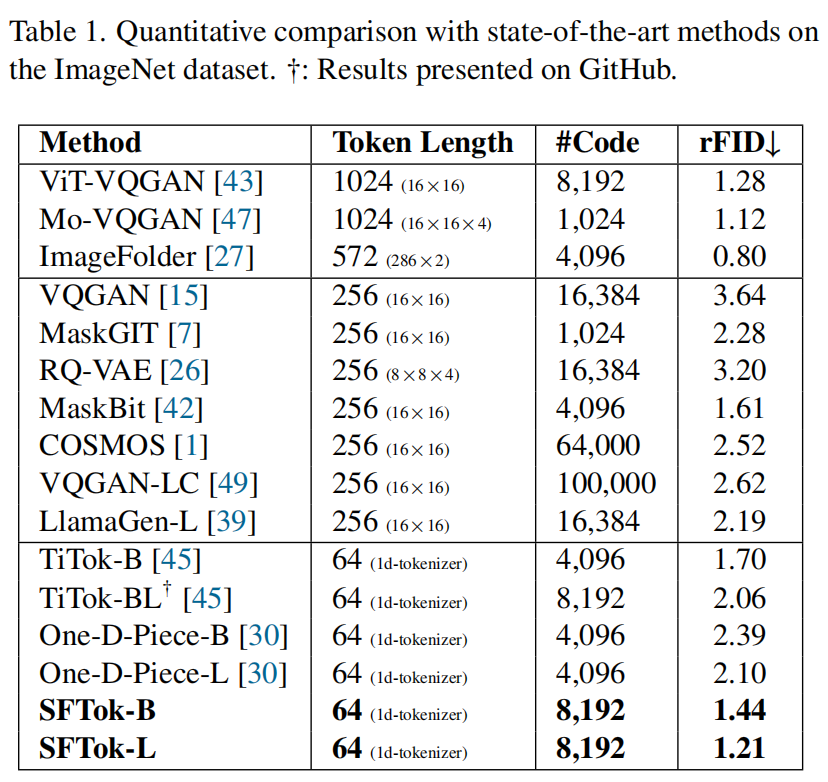

# SFTok: Bridging the Performance Gap in Discrete Tokenizers

[](https://arxiv.org/abs/2512.16910v1)
[](https://neur-io.github.io/SFTok/)
[](https://huggingface.co/spaces/AndyRaoTHU/SFTok)
[](https://zhuanlan.zhihu.com/p/1976302623838716254)

- ***SFTok resolves the training-inference inconsistency in multi-step process, significantly
enhancing image reconstruction quality.***
- ***If you are interested in the training stability of discrete tokenizers, please check out our previous work [OptVQ](https://github.com/Neur-IO/OptVQ); [ReVQ](https://github.com/Neur-IO/ReVQ).***



## News

| **2025-12-15:** We release the training code of SFTok.  
| **2025-12-17:** We release the checkpoints of SFTok-B and SFTok-L.


## Abstract
Recent advances in multimodal models highlight the pivotal role of image tokenization in high-resolution image generation. By compressing images into compact latent representations, tokenizers enable generative models to operate in lower-dimensional spaces, thereby improving computational efficiency and reducing complexity. Discrete tokenizers naturally align with the autoregressive paradigm but still lag behind continuous ones, limiting their adoption in multimodal systems. To address this, we propose **SFTok**, a discrete tokenizer that incorporates a multi-step iterative mechanism for precise reconstruction. By integrating **self-forcing guided visual reconstruction** and **debias-and-fitting training strategy**, SFTok resolves the training-inference inconsistency in multi-step process, significantly enhancing image reconstruction quality. At a high compression rate of only 64 tokens per image, SFTok achieves state-of-the-art reconstruction quality on ImageNet **(rFID = 1.21)** and demonstrates exceptional performance in class-to-image generation tasks **(gFID = 2.29)**.

## Installation
```shell
pip3 install -r requirements.txt
```

## Get Started
In the following, we use SFTok-B as an example to describe how to utilize SFTok for the training and evaluation of the image reconstruction task.
The sole distinction between SFTok-L and SFTok-B lies in their decoder architectures: SFTok-L utilizes a ViT-Large framework while SFTok-B employs a ViT-Base framework.
<p>

</p>

## Inference

Please download the pre-trained models from the following links:

| Model | Link (Tsinghua) | Link (Hugging Face) |
| - | - | - |
| SFTok-B | [Download](https://cloud.tsinghua.edu.cn/d/c859fefcdcc04491a5c5/) | [Download](https://huggingface.co/AndyRaoTHU/SFTok-B) |
| SFTok-L | [Download](https://cloud.tsinghua.edu.cn/d/f914825c11a2495b852f/) | [Download](https://huggingface.co/AndyRaoTHU/SFTok-L/) |


### Option 1: Load from Hugging Face

You can load from the Hugging Face model hub by running the following code:
```python
# Example: load the SFTok-B
from modeling.sftok import SFTok
model = SFTok.from_pretrained("AndyRaoTHU/SFTok-B")
```

### Option 2: Load from the local checkpoint

You can also write the following code to load the pre-trained model locally:
```python
# Example: load the SFTok-B
from omegaconf import OmegaConf
from modeling.sftok import SFTok
import torch
config = OmegaConf.load(config_path)
# setup the model
model = SFTok(config)

# load the pre-trained model
state_dict = torch.load(model_ckpt_path, map_location='cpu')
model.load_state_dict(state_dict, strict=True)
```

### Perform inference

After loading the model, you can perform inference (reconstruction):

```python
from omegaconf import OmegaConf
from modeling.sftok import SFTok
import torch
config = OmegaConf.load(config_path)
# setup the model
model = SFTok(config)

# load the pre-trained model
state_dict = torch.load(model_ckpt_path, map_location='cpu')
model.load_state_dict(state_dict, strict=True)

dataset = ...
image = dataset[...]
encoded_tokens = model.encode(image)[1]["min_encoding_indices"]
reconstructed_images = model.decode_tokens(encoded_tokens)
```

Alternatively, you can directly use the reconstruction example code we provide (toy_example/sftok_recon.py).

## Training Preparation
We use webdataset format for data loading.
To begin with, it is needed to convert the dataset into webdataset format. 

Furthermore, the stage1 and stage2 training relies on a pre-trained MaskGIT as a teacher model. 需要 download the pre-trained MaskGIT model and use it to generate the proxy codes for the training dataset.

## Train Tokenizer (SFTok-B as example)
We provide the following example commands for training SFTok (using SFTok-B as an instance). 
During training, you can monitor various metrics such as rFID through the TensorBoard logs, which contain curves tracking the progression of training statistics.
```bash
# Training for SFTok-B
# Stage 1
bash run_stage1.sh

# Stage 2
bash run_stage2.sh

# Stage 3
bash run_stage3.sh
```

## Train Generator
We employ the generative model architecture proposed by MaskGIT as our foundational framework. 
Below, we provide example commands for training the SFTok generator, using SFTok-B as an instance.

### Training (SFTok-B as example)
We provide example commands to train the SFTok generator as follows, using SFTok-B as an example:
```bash
bash run_generator.sh
```

### Evaluation (SFTok-B as example)
We provide example commands to evaluate the SFTok generator as follows, using SFTok-B-64 as an example.
The evaluation process is carried out using the open-source code and assessment files provided by OpenAI.
```bash
git clone https://github.com/openai/guided-diffusion.git
wget https://openaipublic.blob.core.windows.net/diffusion/jul-2021/ref_batches/imagenet/256/VIRTUAL_imagenet256_labeled.npz

bash run_eval_generation.sh
```
